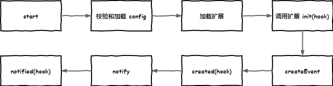

# Ohbug - 前端监控新方向

众所周知，前端监控包括了异常监控、行为监控、性能监控等等，且每种业务对于需要监控的内容既有共通的异常、性能监控等，又有自定义的用户行为、用户画像等内容需要收集。

常用的监控平台已有许多，sentry、fundebug、frontjs 等，他们从异常监控、数据分析到告警通知等一系列功能都很成熟。

那么为什么不选用他们还要自己搞一套出来呢？

其实在部分情况下上述平台基本可以满足需求，无非是使用体验或是功能上的细微差别。

但是在另一部分场景，我们可能需要特殊场景的监控，比如某个模块、某个页面的曝光率，或是某个页面出现异常需要得到用户的真实反馈，这些特殊的场景产生的数据没有一个统一的方式去收集、处理、分析。

所以不同于以往的监控工具，我们希望打造一个开源的基础工具，基于扩展/插件的形式扩展，以支持各式各样的监控需求。

为了达到目的，我们希望通过类似微内核架构的设计，借以扩展机制实现，从初始化、创建事件、上报三大流程入手，三个阶段皆可自定义修改，以此支持各种监控需求。

## 核心

首先我们希望设计一个核心的数据收集程序 [@ohbug/core](https://github.com/ohbug-org/ohbug/tree/master/packages/ohbug-core)，它需要具备参数的验证、扩展的加载、数据的封装、上报数据这么几个功能。

这个核心程序不单单可以收集异常数据、收集性能信息，还可以收集用户行为、用户身份甚至你所想要的任何信息。

下面是核心工作的整个生命周期。



## 扩展

*Ohbug* 的关键是扩展机制，所以扩展必须可以很简单的与多数数据收集工具结合。例如 [perfume.js](https://github.com/Zizzamia/perfume.js)，它是一个轻量的 Web 性能监控工具，我们对它进行了简单的封装，短短十几行代码便可完成一个扩展（[@ohbug/extension-perfume](https://github.com/ohbug-org/ohbug/tree/master/packages/ohbug-extension-perfume)）。

### 浏览器扩展

我们为浏览器环境整合了一套浏览器扩展 [@ohbug/browser](https://github.com/ohbug-org/ohbug/tree/master/packages/ohbug-browser)，它集成了异常监控（JavaScript 代码错误&资源错误、没有被 `reject` 处理的 `Promise` 错误、`AJAX/Fetch` 错误、`Websocket` 错误）、行为监控（路由切换、点击事件、console等信息）、用户画像设置、自定义数据收集等功能，方便快速接入业务。

### 框架扩展

框架层面的扩展均以 [@ohbug/browser](https://github.com/ohbug-org/ohbug/tree/master/packages/ohbug-browser) 为基础，除了浏览器扩展的功能外新增了一些与框架相关的信息，相当于对 [@ohbug/browser](https://github.com/ohbug-org/ohbug/tree/master/packages/ohbug-browser) 的进一步扩展。

#### React

[@ohbug/react](https://github.com/ohbug-org/ohbug/tree/master/packages/ohbug-react) 使用 `componentDidCatch` 生命周期封装了一个错误边界组件，用以捕获在子组件树中任何地方的 JavaScript 异常，并且可以展示备用 UI 而非让组件树崩溃。

你可以通过为组件传入 `FallbackComponent` prop 来定义备用 UI。

```jsx
import React from 'react'
import Ohbug from '@ohbug/browser'
import OhbugReact from '@ohbug/react'

const client = Ohbug.init({ apiKey: 'YOUR_API_KEY' })
const OhbugErrorBoundary = client.use(OhbugReact, React)

function App() {
  return (
    <div className="App">
      <OhbugErrorBoundary>
        <HelloWorld />
      </OhbugErrorBoundary>
    </div>
  )
}
```

#### Vue

[@ohbug/vue](https://github.com/ohbug-org/ohbug/tree/master/packages/ohbug-vue) 使用 `Vue.config.errorHandler` 函数处理错误，除了错误信息外还可获取到 Vue 实例相关的数据。

```javascript
import Vue from 'vue'
import Ohbug from '@ohbug/browser'
import OhbugVue from '@ohbug/vue'

const client = Ohbug.init({ apiKey: 'YOUR_API_KEY' })
client.use(OhbugVue, Vue)
```


### 更多扩展

- [@ohbug/extension-perfume](https://github.com/ohbug-org/ohbug/tree/master/packages/ohbug-extension-perfume): 封装 [perfume.js](https://github.com/Zizzamia/perfume.js)，用于收集性能信息。
- [@ohbug/extension-rrweb](https://github.com/ohbug-org/ohbug/tree/master/packages/ohbug-extension-rrweb): 封装 [rrweb](https://github.com/rrweb-io/rrweb)，用于“录屏”。
- [@ohbug/extension-uuid](https://github.com/ohbug-org/ohbug/tree/master/packages/ohbug-extension-uuid): 扩展 `Event.user` 增加 `UUID` 标识。

> 举个栗子，当我需要对某个项目做简单的异常监控，只需要接入 [@ohbug/browser](https://github.com/ohbug-org/ohbug/tree/master/packages/ohbug-browser)。
> 
> 当然如果你的项目是基于 Vue 实现的，并且想收集更多 Vue 实例相关的异常数据，那么只需要多写一行代码 `client.use(OhbugVue, Vue)`。
> 
> 等等我还想收集用户的性能信息，那就再多写一行 `client.use(OhbugExtensionPerfume)`
> 
> 等等我还想给用户加上唯一标识好区分，那就在多写一行 `client.use(OhbugExtensionUUID)`
> 
> 等等......

### 创建扩展

如果你有自己独特的需求，可以根据需要自行创建扩展。创建一个扩展非常简单：

```shell
yarn add @ohbug/core
```

```javascript
import { createExtension } from '@ohbug/core'

export const extension = createExtension({
  name: 'ExtensionName',
  init: () => {
    // 这里初始化数据收集的程序
  }
})
```

### 修改事件

除了主动收集信息，扩展也可用于对已收集的事件进行修改。例如这个扩展 [@ohbug/extension-uuid](https://github.com/ohbug-org/ohbug/tree/master/packages/ohbug-extension-uuid)，它可为每一条事件新增一个 `UUID` 的字段，用于用户身份的识别，它的代码大概如下：

```javascript
import { createExtension } from '@ohbug/core'
import { getUUID } from './uuid'

export const extension = createExtension({
  name: 'OhbugExtensionUUID',
  created: (event) => {
    const uuid = getUUID()
    event.setUser({
      uuid,
    })
    return event
  },
})
```

### 开源

还有许多有用的东西可以作为扩展，我们也在为丰富扩展完善核心模块而努力。

一个人的力量有限，我们拥抱开源一方面也是为了集中力量办事，希望有更多开发者加入进来，完善 Ohbug，丰富扩展市场。

## 结语

上述内容所提及的内容均以开源 [Ohbug](https://github.com/ohbug-org/ohbug)，更多文档可见 [Ohbug Docs](https://ohbug.net/docs/integration/Installation)。后续会分享关于前端监控的内容。

---

<div align="center">
  <p>关注 Ohbug 公众号</p>

  
</div>